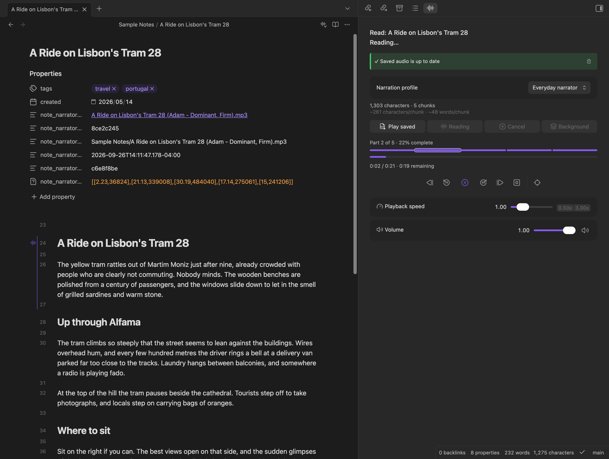

# Note Narrator

Note Narrator is an Obsidian plugin that **reads your notes aloud** using text to speech. It uses [ElevenLabs](https://elevenlabs.io) voices, starts playing while the rest of the note is still being generated, and can save the audio as an `.mp3` next to your note.

**Requires an ElevenLabs account and API key, and ElevenLabs charges for the audio it generates** (credits on your plan; free tier limits apply). The text you read is sent to ElevenLabs. See [Requirements and costs](#requirements-and-costs) and [Disclosures](#disclosures) before installing.

## What it does

- Reads the whole note, or just your text selection, from a sidebar panel or the **Read note aloud** command (**Stop reading** stops it).
- **Narrator profiles**: a provider, a voice and its settings, and optional per-profile reading options. Switch profiles from the panel.
- Plays as soon as the first chunk is ready, and generates long notes in the background while you listen.
- **Background generation**: move a read to the background, or generate a note's audio there without playing it (the **Background** button in the panel, or the **Generate note audio in background** command). Background notes generate one at a time, and you can play them from the panel when they're ready.
- Optionally **saves the audio** to your vault, links it from the note, and tells you when it is outdated.
- Optionally **highlights** the text being read and scrolls the note to it.
- Works on desktop and mobile.

## Documentation

Full documentation is at **[the Note Narrator docs](https://publish.obsidian.md/pablokvitca-plugin-note-narrator/note-narrator)**:

- [Installation](https://publish.obsidian.md/pablokvitca-plugin-note-narrator/note-narrator/getting-started/installation) and [Quick start](https://publish.obsidian.md/pablokvitca-plugin-note-narrator/note-narrator/getting-started/quick-start)
- [Settings](https://publish.obsidian.md/pablokvitca-plugin-note-narrator/note-narrator/settings/overview): every setting, tab by tab
- [Supported platforms](https://publish.obsidian.md/pablokvitca-plugin-note-narrator/note-narrator/reference/supported-platforms) and [Privacy and network use](https://publish.obsidian.md/pablokvitca-plugin-note-narrator/note-narrator/reference/privacy)
- [Troubleshooting and FAQ](https://publish.obsidian.md/pablokvitca-plugin-note-narrator/note-narrator/reference/troubleshooting) and the [Roadmap](https://publish.obsidian.md/pablokvitca-plugin-note-narrator/note-narrator/roadmap)

## Install

Requires **Obsidian 1.13.1 or newer**.

- **Community plugins (recommended):** open **Settings → Community plugins → Browse**, search for **Note Narrator**, and install it.
- **BRAT:** install [BRAT](https://github.com/TfTHacker/obsidian42-brat), run **BRAT: Add a beta plugin for testing**, and enter `pablokvitca/note-narrator`, to get updates ahead of the community directory or a beta build.
- **Manually:** download `main.js`, `manifest.json` and `styles.css` from the [latest release](https://github.com/pablokvitca/note-narrator/releases/latest) into `<your vault>/.obsidian/plugins/note-narrator/`, then enable it under **Settings → Community plugins**.

## Quick start

1. Create an [ElevenLabs](https://elevenlabs.io) account and API key. Then open **Settings → Note Narrator → Providers**, open the ElevenLabs provider and choose your API key.
2. Open a note, click the **audio-lines** icon in the ribbon (or the note's toolbar) to open the panel, and press **Read**.

## Requirements and costs

- You need an **ElevenLabs account and API key**. Note Narrator is free, but **ElevenLabs charges for the audio it generates** (credits on your ElevenLabs plan, and free tier limits apply). You are responsible for those costs.
- Reading needs an **internet connection**. There is no offline mode yet.
- Saved audio replays for free. Regenerating it, or reading again, uses credits again.
- **ElevenLabs' terms apply to you and the audio.** You must be 18 or over (or of legal age where you live). Free accounts may use the service for non-commercial purposes only, while paid plans may use it commercially. Check your plan before using saved audio commercially.

## Disclosures

Obsidian asks plugins to be clear about what they do with your data. For Note Narrator:

- **Network use.** The plugin talks to **one external service, ElevenLabs (`api.elevenlabs.io`)**, and only in these cases:
  - **Reading and regenerating audio** (including background generation, and "Auto-generate on open" if you turn it on, which also needs saving and linking turned on): sends the **text being read**, the chosen voice and model settings, and your API key. Requests that ElevenLabs rate-limits are retried automatically and resend the same text, which can use more credits.
  - **Listing voices**: sends your API key whenever you open a narrator profile's settings (with an API key set) or press the voice refresh button.
  - **Naming a saved audio file** after its voice: sends your API key and the voice ID, each time audio is saved (including automatic saves).
  - Replaying saved audio needs no network access and uses no credits.
- **What is read.** The text sent is the note or selection after Markdown is stripped, plus the note title and properties if you enabled those. **Anything you read leaves your device and is processed by ElevenLabs** under their [Terms of Service](https://elevenlabs.io/terms-of-use) and [Privacy Policy](https://elevenlabs.io/privacy-policy). The plugin author has no control over how ElevenLabs stores or uses that data. Do not read notes containing text you are not willing to send to them.
- **Your API key** is stored in Obsidian's built-in secret storage, not in the plugin's `data.json`. Only the name of the secret is saved.
- **Files it writes.** Settings in the plugin's `data.json`. If you turn on saving: `.mp3` files in your vault (next to the note, or in a folder you choose) and, with linking on, a few properties in the note's frontmatter. **Clear Note Narrator files** moves the linked `.mp3` to the trash (following your vault's deletion setting) and removes those properties. The plugin does not read or write files outside your vault.
- **No telemetry, no ads, no self-updates.** The plugin collects no usage data, shows no advertising, and does not install or update itself or any code.
- **Synthetic voices.** The audio is AI-generated. If you share it, consider saying so, and follow ElevenLabs' rules on voice rights and permitted content (see their [Prohibited Use Policy](https://elevenlabs.io/use-policy)).

## What to expect

- Behaviour and settings can still change between releases, and existing settings are migrated when they do.
- HTML comments (`<!-- like this -->`) are not skipped and are read as text. Obsidian comments (`%% like this %%`) can be skipped.
- Editing a note marks its saved audio as outdated, even if the edit was outside the text that was read.
- Highlighting needs the note open in Editing view and is approximate at chunk and section boundaries.
- More known limitations and the roadmap are in the documentation.

## Disclaimer

Note Narrator is provided **"as is", without warranty of any kind**. The author is not liable for any costs, data loss, or other damages arising from its use, including ElevenLabs charges. It is an independent project, **not affiliated with, endorsed by, or sponsored by ElevenLabs or Obsidian**. All trademarks belong to their owners.

## License

The source code is open: [github.com/pablokvitca/note-narrator](https://github.com/pablokvitca/note-narrator). The `main.js` in each release is built from this repository by GitHub Actions. Released under the [0BSD license](LICENSE). Third-party attributions and notices are in [THIRD_PARTY_NOTICES.md](THIRD_PARTY_NOTICES.md).

## Development

`npm i` to install, `npm run dev` to build in watch mode, `npm run build` to type-check and produce a production `main.js`, `npm run lint` and `npm test` to check. The branching model and release process are in [AGENTS.md](AGENTS.md).
