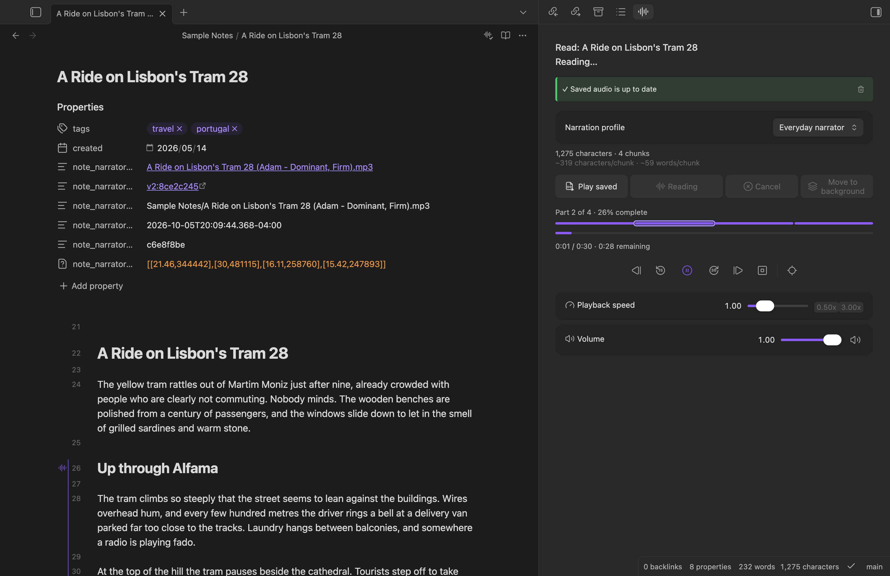
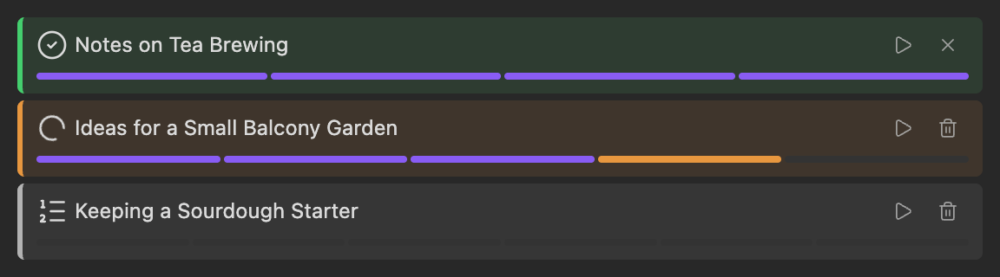
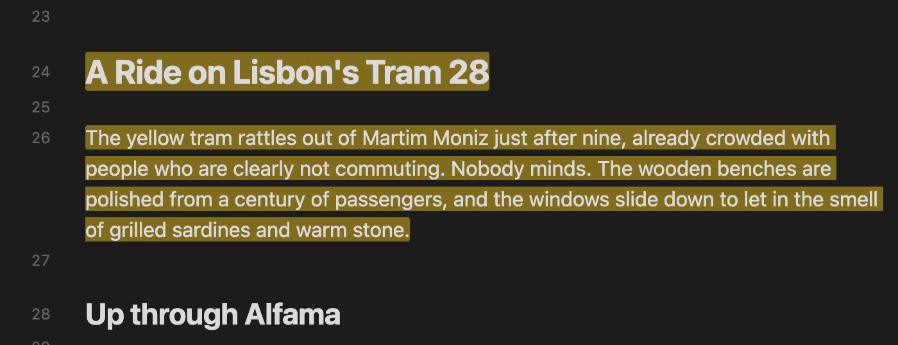
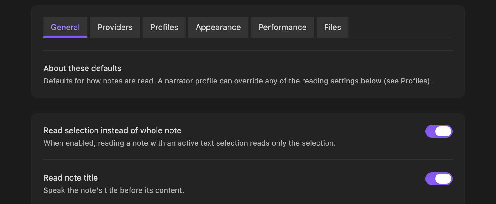

# Note Narrator

Note Narrator is an Obsidian plugin that **reads your notes aloud** using text to speech. Open the panel, press **Read**, and it starts playing while the rest of the note is still being generated. It can save the audio as an `.mp3` next to your note, so you can listen again for free.

**Requires an ElevenLabs account and API key, and ElevenLabs charges for the audio it generates** (credits on your plan; free tier limits apply). The text you read is sent to ElevenLabs. See [Requirements and costs](#requirements-and-costs) and [Disclosures](#disclosures) before installing.

**Full documentation and usage guide: [the Note Narrator docs](https://publish.obsidian.md/pablokvitca-plugin-note-narrator/note-narrator).**

## Key features

- **Read aloud** the whole note, or just your selection, from the panel or the **Read note aloud** command. Playback starts as soon as the first part is ready.
- **Playback controls:** pause, rewind and skip, previous and next part, speed and volume.
- **Highlighting:** the part being read is marked in the editor, as a margin marker, background wash or underline, and you can scroll to it.
- **Background generation:** generate notes without playing them, one at a time, and play them from the panel when they're ready. A note edited since is marked **Outdated**.
- **Saved audio:** save the audio as an `.mp3` in your vault, link it from the note, and see when it's out of date. Replaying it uses no credits.
- **Narrator profiles:** a provider, a voice and its settings, and optional reading options, switchable from the panel.
- **Reading options:** read the title and properties, skip sections by heading, skip comments, and choose how notes are split into parts.
- Works on desktop and mobile.

## Platforms

Note Narrator uses only Obsidian's cross-platform APIs, so every feature is the same on every device. The difference is how much each platform has been tested.

| Feature | macOS | Windows | Linux | iPhone | iPad | Vision Pro | Android |
| --- | --- | --- | --- | --- | --- | --- | --- |
| Read aloud and playback controls | ✅ | ❔ | ❔ | ✅ | ✅ | ✅ | ❔ |
| Highlighting and scroll to current | ✅ | ❔ | ❔ | ✅ | ✅ | ✅ | ❔ |
| Background generation | ✅ | ❔ | ❔ | ✅ | ✅ | ✅ | ❔ |
| Saved audio | ✅ | ❔ | ❔ | ✅ | ✅ | ✅ | ❔ |
| Narrator profiles and settings | ✅ | ❔ | ❔ | ✅ | ✅ | ✅ | ❔ |

✅ Tested on a real device. ❔ Should work, but nobody has tried it yet; reports welcome. iPad includes iPad mini. Requires **Obsidian 1.13.1 or newer** everywhere. Details: [Supported platforms](https://publish.obsidian.md/pablokvitca-plugin-note-narrator/note-narrator/reference/supported-platforms).

## Text to speech providers

| | ElevenLabs | Google Gemini | Apple OS (Local) |
| --- | --- | --- | --- |
| Status | ✅ Available | 🔜 Planned | 🔜 Planned |
| Platforms | All | All | Apple devices only |
| Needs an account and API key | Yes | Yes | No |
| Needs an internet connection | Yes | Yes | No |
| Costs | Credits on your ElevenLabs plan | Google's API pricing | Free |
| Voices | Your account's voices | 🔜 | 🔜 |
| Models | Eleven v3, Eleven Multilingual v2, Eleven Flash v2.5 | 🔜 | 🔜 |
| Voice settings | Stability, similarity | 🔜 | 🔜 |
| Parallel generation | Yes, with automatic retry when rate-limited | 🔜 | 🔜 |

Planned providers are on the [Roadmap](https://publish.obsidian.md/pablokvitca-plugin-note-narrator/note-narrator/roadmap). Plans can change.

## Install

Requires **Obsidian 1.13.1 or newer**.

- **Community plugins (recommended):** open **Settings → Community plugins → Browse**, search for **Note Narrator**, and install it.
- **BRAT:** install [BRAT](https://github.com/TfTHacker/obsidian42-brat), run **BRAT: Add a beta plugin for testing**, and enter `pablokvitca/note-narrator`, to get updates ahead of the community directory or a beta build.
- **Manually:** download `main.js`, `manifest.json` and `styles.css` from the [latest release](https://github.com/pablokvitca/note-narrator/releases/latest) into `<your vault>/.obsidian/plugins/note-narrator/`, then enable it under **Settings → Community plugins**.

Then follow the [Quick start](https://publish.obsidian.md/pablokvitca-plugin-note-narrator/note-narrator/getting-started/quick-start): add your ElevenLabs API key under **Settings → Note Narrator → Providers**, open a note, open the panel from the ribbon, and press **Read**.

## Requirements and costs

- You need an **ElevenLabs account and API key**. Note Narrator is free, but **ElevenLabs charges for the audio it generates** (credits on your ElevenLabs plan, and free tier limits apply). You are responsible for those costs.
- Reading needs an **internet connection**. There is no offline mode yet.
- Saved audio replays for free. Regenerating it, or reading again, uses credits again.
- **ElevenLabs' terms apply to you and the audio.** You must be 18 or over (or of legal age where you live). Free accounts may use the service for non-commercial purposes only, while paid plans may use it commercially. Check your plan before using saved audio commercially.

## Disclosures

Obsidian asks plugins to be clear about what they do with your data. For Note Narrator:

- **Network use.** The plugin talks to **one external service, ElevenLabs (`api.elevenlabs.io`)**, and only in these cases:
  - **Reading and regenerating audio** (including background generation, and "Auto-generate on open" if you turn it on, which also needs saving and linking turned on): sends the **text being read**, the chosen voice and model settings, and your API key. Requests that ElevenLabs rate-limits are retried automatically and resend the same text, which can use more credits.
  - **Listing voices**: sends your API key whenever you open a narrator profile's settings (with an API key set) or press the voice refresh button.
  - **Naming a saved audio file** after its voice: sends your API key and the voice ID, each time audio is saved (including automatic saves).
  - Replaying saved audio needs no network access and uses no credits.
- **What is read.** The text sent is the note or selection after Markdown is stripped, plus the note title and properties if you enabled those. **Anything you read leaves your device and is processed by ElevenLabs** under their [Terms of Service](https://elevenlabs.io/terms-of-use) and [Privacy Policy](https://elevenlabs.io/privacy-policy). The plugin author has no control over how ElevenLabs stores or uses that data. Do not read notes containing text you are not willing to send to them.
- **Your API key** is stored in Obsidian's built-in secret storage, not in the plugin's `data.json`. Only the name of the secret is saved.
- **Files it writes.** Settings in the plugin's `data.json`. If you turn on saving: `.mp3` files in your vault (next to the note, or in a folder you choose) and, with linking on, a few properties in the note's frontmatter. **Clear Note Narrator files** moves the linked `.mp3` to the trash (following your vault's deletion setting) and removes those properties. The plugin does not read or write files outside your vault.
- **Other notes it looks at.** Only one thing, on by default: before replacing or trashing a note's saved audio, it checks the other notes' Note Narrator audio path property, from Obsidian's metadata cache and never the notes' text, so a copied note doesn't overwrite or trash audio it shares with the original. That check lists every note in your vault, which is why Obsidian's plugin scanner reports "vault enumeration". Nothing it sees leaves your device. Turning off **Protect audio shared with copied notes** (Files tab) skips it, but then regenerating or clearing a copied note can overwrite or trash the original's audio.
- **No telemetry, no ads, no self-updates.** The plugin collects no usage data, shows no advertising, and does not install or update itself or any code.
- **Synthetic voices.** The audio is AI-generated. If you share it, consider saying so, and follow ElevenLabs' rules on voice rights and permitted content (see their [Prohibited Use Policy](https://elevenlabs.io/use-policy)).

More detail: [Privacy and network use](https://publish.obsidian.md/pablokvitca-plugin-note-narrator/note-narrator/reference/privacy). Known limitations, such as HTML comments being read aloud, are listed in the [docs](https://publish.obsidian.md/pablokvitca-plugin-note-narrator/note-narrator/reference/known-limitations).

## Disclaimer

Note Narrator is provided **"as is", without warranty of any kind**. The author is not liable for any costs, data loss, or other damages arising from its use, including ElevenLabs charges. It is an independent project, **not affiliated with, endorsed by, or sponsored by ElevenLabs or Obsidian**. All trademarks belong to their owners.

## License

The source code is open: [github.com/pablokvitca/note-narrator](https://github.com/pablokvitca/note-narrator). The `main.js` in each release is built from this repository by GitHub Actions. Released under the [0BSD license](LICENSE). Third-party attributions and notices are in [THIRD_PARTY_NOTICES.md](THIRD_PARTY_NOTICES.md).

## Development

See [DEVELOPMENT.md](DEVELOPMENT.md) and [CONTRIBUTING.md](CONTRIBUTING.md) for details on dev setup and contributions.
